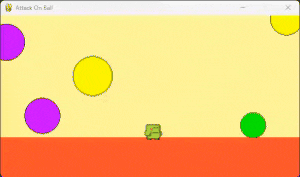

# DQN Pytorch AttackOnBall


## Run code
```
cd ./DeepQ
python train.py 
```

## Hyperparameters
```
# goal
# 100s * 120f/s = 12000f
MEAN_REWARD_GOAL = 12_000

# preprocess
FRAME_STACK = 4
IMG_SIZE = (600, 325)
IMG_RESIZE = (128, 84)
CLIP_REWARD = 4

# training
BATCH_SIZE = 32
LEARNING_RATE = 1e-4

GAMMA = 0.99
EPSILON_START = 1.
EPSILON_END = 0.1
EPSILON_STEP = 100

MEMORY_SIZE = 100
SYNC_TARGET_FRAMES = 10
```
